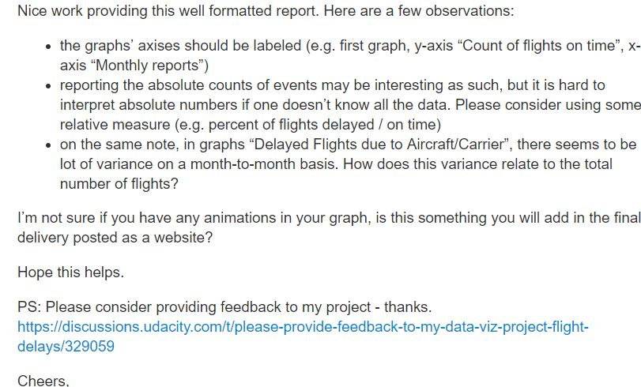
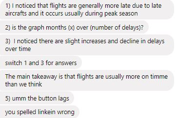

# P6-AdvancedVisualization-FlightData

[Exploratory Analysis: Visualization](http://bl.ocks.org/CloudChaoszero/raw/7ca3a026058ef7bea440d34734b59255/)

## Overview

### Summary

We implement an explanatory data analysis through advanced visualization from a flight dataset. We utilize dimple.js and/or d3.js to create our advanced visualizations.

This dataset contains United State flight delays and performances from RITA. Also, it contains entries from the year 2006 to 2010, and can be found [here](https://www.transtats.bts.gov/OT_Delay/OT_DelayCause1.asp)

### Design

- **What type of Variables will I be Utilizing?**

I plan to publish several time-series graphs on several delay cases, numerical features. 

These flight delay cases will be plotted against the 2006-2010 monthly time series.

Thereafter, I will focus on an extreme case--cancelled flights. 

- **What type of visualization(s) will I be implementing, with respect to the pre-selected variables above?**

All visualizations will be:
1. Scatterplot
2. Line plot

- **What type of design features should I consider?**

The desing features I will consider are:

1. Highlight trends of information

2. Not creating conflicting color themes

3. Minimize labeling for optimall reader interpretation

- **How would the above considerations enrich the quality of my EDA visualization?**

The above considerations allow us to see explicit importances of flight delays from 2006-2010. Moreover, the reader avoids conflicting visualizations for readability.

## Feedback

### Review 1

Contacted an individual through a forum, and received this wonderful response

I ended up redoing my initial data documenation, export, and more because of this review.
Definitely a rewarding experience in project management.

### Review 2

Contacted an individual through social media, and received this...interesting, yet blunt, response

I edited my bars, fixed a graph discrepancy, and did some minor text editing for readability.

### Review 2

Contacted an individual through social media, and received this wonderful response

I edited my title, fixed a graph bug, and did some minor text editing.

## Resources

1. [Flight Data](https://www.transtats.bts.gov/OT_Delay/OT_DelayCause1.asp)

2. [Dimple Basics](http://napitupulu-jon.appspot.com/posts/dimple-ud507.html)

3. [bz2 import](https://pymotw.com/2/bz2/)

4. [Data Dictionary](https://www.transtats.bts.gov/Fields.asp)

5. [Encoding German Codec](https://stackoverflow.com/questions/18197772/python-german-umlaut-issues-ascii-codec-cant-decode-byte-0xe4-in-position-1)

6. [Faster Data Loading through Sampling](http://nikgrozev.com/2015/06/16/fast-and-simple-sampling-in-pandas-when-loading-data-from-files/)

7. [Types of Recorded Delays](https://www.rita.dot.gov/bts/help/aviation/html/understanding.html#q4)

8. [The Great Recession](http://www.investopedia.com/terms/g/great-recession.asp)

9. [EDA Visualization Design/Planning](http://guides.library.georgetown.edu/datavisualization)

10. [How to add a Data Viz Legend](https://stackoverflow.com/questions/28739608/completely-custom-legend-in-matplotlib-python)

11. [HTTP Server](http://chimera.labs.oreilly.com/books/1230000000345/ch04.html#_setting_up_a_web_server)

12. [Background Image](https://www.google.com/search?biw=606&bih=575&tbm=isch&sa=1&q=background+css+image+dark+white&oq=background+css+image+dark+white&gs_l=psy-ab.3...92336.95879.0.96074.25.17.4.0.0.0.258.1436.6j3j2.11.0....0...1.1.64.psy-ab..11.4.359...0i8i30k1j0i30k1.f3QHc9AxKxM#imgrc=HSHmvfOVKkYjTM:)

13. [Get Data in Dimple.js](http://www.d3noob.org/2012/12/getting-data.html)

14. [Delay Definitions](http://aspmhelp.faa.gov/index.php/Types_of_Delay)

## [Data Dictionary](https://www.transtats.bts.gov/Fields.asp)

1. **year:** Year

2. **month:** Month

3. **carrier:** Code assigned by IATA and commonly used to identify a carrier. As the same code may have been assigned to different carriers over time, the code is not always unique. For analysis, use the Unique Carrier Code.

4. **carrier_name:** Carrier Name

5. **airport** Airport Code

6. **airport_name** Airport Name

7. **arr_flights:** Count of on-time arrival of flights

8. **arr_del15** Count of flights delayed by 15min arrivals

9. **carrier_ct:** Count of flights delayed due to carrier delay

10. **weather_ct:** Count of flights delayed due to weather concerns

11. **nas_ct** Count of flights delayed due to National Airspace System (NAS) control

12. **security_ct** Count of flights delayed due to security measures

13. **late_aircraft_ct** Count of flights delayed due to logistic situations

14. **arr_cancelled** Count of flights cancelled

15. **arr_diverted:** Count of flights diverted

16.  **arr_delay:** Difference in minutes between scheduled and actual arrival time. Early arrivals show negative numbers.

17. **carrier_delay:** Carrier Delay, in Minutes

18. **weather_delay:** Weather Delay, in Minutes

19. **nas_delay:** National AirspaceSystem Delay, in Minutes

20. **security_delay:** Security Delay, in Minutes

21. **late_aircraft_delay:** Late Aircraft Delay, in Minutes
